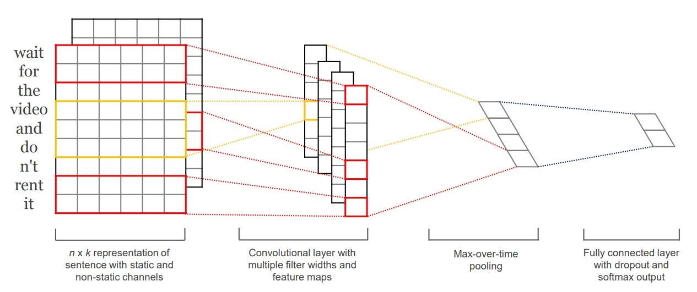
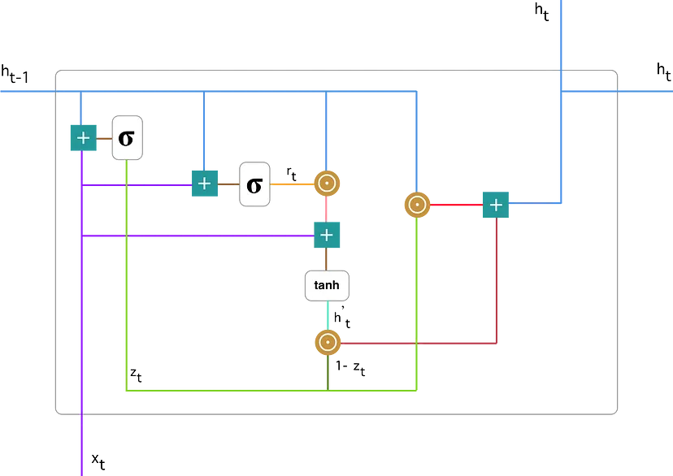

# 文本情感分类  实验报告

## 结构图与流程分析

### CNN

在代码实现中，我设置了：

- 一个词嵌入层 `embedding`，并根据预训练的词嵌入向量初始化权重。
- 三个卷积层 `conv1`、`conv2`、`conv3`，每个卷积层都使用不同大小的卷积核 `kernel_size[]`，并具有相同数量的输出通道数 `kernel_num`。
  - 在每次卷积操作之后，都用 ReLU 作为激活函数。
  - 同时用最大池化 `max_pool1d` 对特征进行池化。
- 一个丢弃层 `dropout`，和一个全连接层 `fc`。

整体的前向传播过程如下：

- 接收输入 tensor `x` 作为参数。
- 首先，通过词嵌入层将输入文本索引转换为词嵌入表示，并进行维度扩展。
- 然后，分别对输入进行卷积和池化操作，得到三个不同大小的特征图（`x1`、`x2`、`x3`）。
- 将三个特征图连接起来，并通过丢弃层进行正则化。
- 最后，通过全连接层进行分类，并应用 `log_softmax` 函数进行归一化。

### RNN

#### LSTM

下面是 LSTM 的组织架构：

在代码中，我设置了：

- 一个词嵌入层：
  模型首先使用 `nn.Embedding` 层将输入的词索引转换为词嵌入表示。词嵌入层的维度为 `vocab_size*embedding_dim`，其中 `vocab_size` 表示词汇表中唯一词的数量，`embedding_dim` 表示每个词嵌入的维度。
- 一个 LSTM 编码层：
  经过嵌入层后，输入的词嵌入将作为LSTM编码器的输入。我在代码中使用的 LSTM 编码器是一个**双向**的多层 LSTM。LSTM编码器接受嵌入层的输出作为输入，并将双向LSTM的隐藏状态输出。其中，`hidden_size` 表示 LSTM 隐藏状态的维度，`num_layers` 表示 LSTM 的层数。
- 一个线性解码层：
  LSTM 编码器的隐藏状态被送入一个线性解码层，该层将隐藏状态的维度扩展为 $64$ 维。这一步通过 `nn.Linear` 层实现。
- 一个全连接输出层：
  线性解码层的输出进一步送入一个全连接层，将其维度从 $64$ 维映射到模型输出的类别数。最终，该层的输出经过 softmax 激活函数后，表示情感类别预测概率。

整体的前向传播过程如下：

- 模型首先对输入进行词嵌入，然后将嵌入的输入传递给 LSTM 编码器。
- LSTM 编码器的输出是最后一个时间步的隐藏状态。
- 进行解码，最终通过全连接层得到预测的类别概率。

#### GRU

将 LSTM 换成 GRU 后即可得到 RNN-GRU。下面是 GRU 的组织架构：

### MLP

MLP 的组织架构相对简单：

- 接收输入 tensor `inputs` 作为参数，表示输入的词索引序列。
- 将输入序列通过嵌入层进行词嵌入表示的转换，得到嵌入后的 tensor。
- 将嵌入后的 tensor 传入 MLP 层进行线性变换，并经过 ReLU 激活函数处理。
- 将 MLP 层的输出进行维度转换后，进行最大池化操作，再进行维度转换，得到池化结果。
- 将池化后的结果传入全连接层进行线性映射，并得到分类结果。

### BERT

BERT 是一种基于 Transformer 架构的预训练模型，用于自然语言处理任务。我在这次实验中也测试了 BERT 在“情感分类”这一下流任务中的表现如何。BERT 的组织架构如下：

- **Transformer Encoder**：BERT 的核心组件是 Transformer Encoder。它由多个相同的层堆叠而成，每个层都包含多头自注意力机制和前馈神经网络。自注意力机制可以捕捉输入序列中不同位置之间的关系，前馈神经网络用于对每个位置的隐藏表示进行非线性变换。通过堆叠多个 Transformer Encoder 层，BERT 可以对输入序列进行深层次的特征提取和表示学习。
- **输入表示**：BERT 接受的输入是一组标记化的文本序列。在输入序列的开头会添加一个特殊的 [CLS] 标记作为整个序列的起始标记。每个输入标记会经过嵌入层转换为对应的词向量。
- **预训练阶段**：BERT 通过两个预训练任务来学习通用的语言表示。第一个任务是 Masked Language Model（MLM），其中输入序列中的一些标记会被随机遮盖，模型需要预测被遮盖的标记。第二个任务是 Next Sentence Prediction（NSP），模型需要判断两个句子是否是连续的。
- **微调**：在完成预训练之后，BERT可以通过微调来适应特定的下游任务，如文本分类、命名实体识别等。在微调阶段，BERT模型的顶部会添加一个或多个任务特定的输出层，以便根据具体任务进行相应的预测。
- **Tokenization**：BERT 使用 WordPiece tokenization 方法对输入文本进行分词，将文本分割为多个子词。

在代码中我直接调用的是已经训练好的 BERT 模型，配置了词汇表大小 `vocab_size`、隐藏层大小 `hidden_size`、隐藏层的数量 `num_hidden_layers`、注意力头数目 `num_attention_heads`、中间层大小 `intermediate_size` 和最大输入序列长度 `max_position_embeddings`。

整体的前向传播过程如下：

- 通过嵌入层进行词嵌入。
- 通过编码层进行编码。
- 通过池化层（这里的池化操作是，只取每一个向量的 [CLS]）进行池化，然后进行 dropout 操作。
- 最后通过线性层映射到分类答案。

## 实验结果

CNN、RNN（LSTM）、RNN（GRU）、MLP（作为 baseline）和 BERT 在训练集、验证集和测试集上的实验结果如以下图表所示。

### 训练集

### 验证集

### 测试集

## 参数比较

以 CNN 模型为例，我选取了 learning rate 和 batch size 两个参数，测试了在不同值的情况下模型在测试集上正确率的变化情况。

### learning rate

实际上我也测试了 learning rate 为 $10^{-1}$、$10^{-5}$ 的情况，但由于正确率过低所以没有展示。在 $10^{-i}(i = 1, 2, 3, 4, 5)$ 中，最佳 learning rate 为 $10^{-3}$。

- learning rate 过高可能会导致参数更新过大，模型在训练过程中无法收敛。这可能会导致损失函数不断增加，训练不稳定甚至发散。
- learning rate 过低可能会导致模型的收敛速度变得非常慢。每次参数更新的步长太小，可能就需要更多的迭代次数才能达到收敛。

### batch size

我测试了 batch size 分别为 $20, 35, 50, 65, 80$ 的情况，发现 $65$ 是这五种情况中最佳的 batch size。

- batch size 过大可能会增加内存需求和过拟合的风险。
- batch size 过小可能会导致参数更新的方差增加，使得训练过程变得不稳定。更重要的是，小批量训练的“视野”太小，可能会使模型难以学习到全局性的特征和模式。

## Baseline 模型与 CNN、RNN、BERT 模型的效果差异

| 项目\模型 |   CNN    | RNN-LSTM | RNN-GRU  |   BERT   | MLP（作为 baseline） |
| :-------: | :------: | :------: | :------: | :------: | -------------------: |
|  准确率   | $0.8374$ | $0.8374$ | $0.8211$ | $0.8509$ |             $0.8103$ |
|  F-score  | $0.8361$ | $0.8361$ | $0.8134$ | $0.8525$ |             $0.8011$ |

对比各个模型在测试集上的准确率和 F-score，可以发现：

- CNN 在准确率和 F-score 上表现不错，但相对于其他模型略有下降。它在处理图像和文本分类等任务中表现出色，通过卷积和池化操作可以提取局部特征并保留空间结构信息，所以在本次情感分类的任务上表现较好。
- RNN-LSTM 在准确率和 F-score 上与 CNN 相当。RNN-LSTM 对于处理序列数据具有优势，可以捕捉到时间依赖关系，适用于自然语言处理和时间序列数据分析。
- RNN-GRU 在准确率和 F-score 上稍微低于 CNN 和 RNN-LSTM。GRU 与 LSTM 类似，但参数更少，计算效率更高。
- BERT 在准确率和 F-score 上表现最好。这可能是因为 BERT 是基于 Transformer 架构的预训练模型，通过自监督学习从大规模文本数据中学习语言表示。BERT 在许多自然语言处理任务中取得了显著的突破，能够捕捉上下文语义和句子关系，所以在情感分类这一任务上表现最佳。
- 作为 baseline 的 MLP 的效果最差，这可能是因为 MLP 只是一种简单的前馈神经网络，它在处理复杂的序列和语义任务时可能无法捕捉到序列和上下文信息，导致情感分类效果不佳。

## 问题思考

> 问题 1：实验训练什么时候停止是最合适的？简要陈述你的实现方式，并试分析固定迭代次数与通过验证集调整等方法的优缺点。

在模型效果不再提升，或是变化幅度不太大的时候就可以停止实验训练。在我的具体实现中，我先固定迭代了 $20$ 次，发现模型在 $10$ 次左右的时候，效果变化就不太明显了。因此，我最终使用的是**固定迭代次数**的方法。

- 固定迭代次数
  - 优点：简单直观，不需要额外的计算或监控验证集性能。
  - 缺点：如果这个固定的次数过小，那么模型还没有学习完，不足以达到最佳；如果这个固定的次数太大，模型在固定迭代次数之前已经过拟合了，此时才停止训练，可能导致模型无法充分收敛和泛化。
- 通过验证集调整
  - 优点：可以根据模型在验证集上的实际性能来决定停止训练，更具灵活性。而且，这样能够自适应地判断什么时候开始过拟合，及时止损，获得更好的泛化能力。
  - 缺点：需要在每个训练步骤后计算模型在验证集上的性能，增加了额外的计算开销。

> 问题 2：实验参数的初始化是怎么做的？不同的方法适合哪些地方？（现有的初始化方法为零均值初始化，高斯分布初始化，正交初始化等）

**零均值初始化**

**高斯分布初始化**

**正交初始化**

> 问题 3：过拟合是深度学习常见的问题，有什么方法可以方式训练过程陷入过拟合？

**数据集扩充**

数据是“死”的，但是人是活的。虽然给定的数据集是一定的，但是我们能够通过对训练数据进行一系列的随机变换、旋转、缩放、裁剪等操作，生成额外的训练样本。这样可以增加训练数据的多样性，有助于模型学习更一般化的特征。

**正则化**

由于更简单的模型泛化能力更强，所以我们需要控制模型变得更简单。“正则化”就是通过在损失函数中引入惩罚项，这样可以限制模型的复杂度。

**Dropout**

在训练过程中，以一定的概率随机将一部分神经元的输出置为 $0$，从而减少神经元之间的依赖关系。这样可以防止模型过度依赖某些特定的神经元，增强模型的泛化能力。我在 CNN 和 BERT 的实现中，均使用了 `dropout` 这一层来对上一层的神经元进行随机置 $0$。 

> 问题 4： 试分析CNN，RNN，全连接神经网络（MLP）三者的优缺点。

## 心得体会
